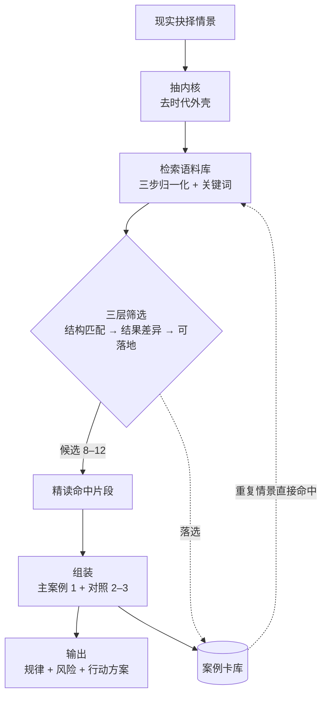

# 古籍抉择推演系统

把 2,550 万字古籍语料做成可检索的决策案例库，为现实抉择提供历史参照。

这个仓库记录了**一次 AI 应用落地的完整过程**：从脏数据的甄别，到检索失效的定位，到质量控制闸门，到成品输出。

---

## 一、问题

遇到人生抉择时，凭感觉判断的成分太大。历史里有大量同构的处境——有人功高被疑、有人兄弟合伙、有人为了事业离家——但要把它们用起来，有三个现实障碍：

1. **语料太多，进不了模型上下文。** 史记加资治通鉴就有 382 万字，加上解读类材料总计 2,550 万字，远超任何上下文窗口。
2. **古籍电子书很脏。** 扫描件没有文字层、不同版本有系统性错字、同一人物在不同译本里译名不同。
3. **直接问模型会编。** 古籍内容容易被模型"合理推测"，而引用一旦编造就失去全部价值。

## 二、方法



**设计原则**

1. **原文永不进上下文。** 语料留在本地，只有命中的片段（几百到几千字）进入对话。单次分析的输入从 2,550 万字压缩到 1 万字以内。
2. **案例卡不复制原文，只存指针。** 卡片记录结构化结论（内核、选项、判断依据、结果、显性/隐性代价）加检索锚点，单卡控制在 700 字内。9 张卡合计 4,129 字，占语料的万分之 1.4。
3. **每条引文带来源标记。** 原文 / 史家评（太史公曰）/ 今人解读 / 案例叙述，四类分开，避免把后人判断当史实。
4. **质量靠闸门，不靠自觉。** 每张新卡入库前必须通过"漏检检查"。

## 三、迭代过程

落地失败通常是因为细节还没到位。

| # | 问题 | 表现 | 处理 |
| --- | --- | --- | --- |
| 1 | 扫描件没有文字层 | 5 个 PDF 提取出 0 字，其中一部 9,890 页 | 逐页判定，标出需 OCR 的部分，改为按需局部处理 |
| 2 | 注释序号插在词中间 | 正文实际是"不善**[23]**代之"，引文检索为 0 | 归一化第一步：去 `[数字]` |
| 3 | 标点差异导致假阴性 | "狡兔死**，**走狗烹"搜不到"狡兔死走狗烹" | 归一化第二步：去标点 |
| 4 | 检索词凭记忆拼接 | 写成"五百人皆自杀"，原文作"五百人在海中……亦皆自杀" | 规定检索词必须取自原文连续片段 |
| 5 | 电子书有系统性错字 | 某版本把"慎靓王"全部写成"慎骰王"，正字 0 次 | 全库甄别，弃用该版本 |
| 6 | 同一本书多份副本 | 同一辑存在字节不同但内容相同的多个文件 | 以提取文本比对为准，去重 |
| 7 | 自己的误判 | 曾判定某电子书"整段重复"，实为目录加正文的正常结构 | 扩大采样点后更正，并记入规范 |

前四条共同指向一件事：**检索失败是静默的**。搜不到时，你不会收到报错，只会以为"库里没有"，然后给出一个基于缺失信息的结论。所以必须有独立的检查机制。

## 四、质量控制

**漏检检查**：每张案例卡带一个"检索词"字段，入库前用这些词回跑全库检索，全部命中才算通过。

实测结果：9 张卡、62 个关键词，初次运行命中 59 个，三次迭代后 62/62 通过——**三次失败各自暴露了一类归一化缺陷**（见上表第 2、3、4 条）。

## 五、数据规模

| 项目 | 数值 |
| --- | --- |
| 语料 | 14 部古籍，7 种文件格式，2,550 万字 |
| 案例卡 | 9 张，4,129 字，占语料万分之 1.4 |
| 单次分析进入上下文的文本 | < 1 万字 |
| 关键词漏检检查 | 62/62 通过 |
| 成品 | 3 个版本的分析（备查版 / 发布版 / 新媒体版） |

## 六、实现方法

```bash
pip install -r requirements.txt

# 1. 关键词检索（对自带的公版样例语料）
python src/retrieve.py --corpus data/sample --keywords 乐毅,燕惠王,骑劫

# 2. 案例卡漏检检查（质量闸门，失败返回非零退出码）
#    样例语料只覆盖 case-001，用 --only 限定；完整语料下为 62/62 通过
python src/audit_cards.py --cards cases/cards --corpus data/sample --only "case-001*"

# 3. 语料体检（对 PDF 判文字层，对文本查噪声）
python src/corpus_audit.py --path data/sample

# 4. 电子书转纯文本（需安装 Calibre）
python src/extract_text.py --input <电子书目录> --output data/full
```

## 七、目录结构

```
.
├── README.md
├── docs/            工作规范（14 节，含分层架构、输出预算、置信度标准、作者偏向档案）
├── cases/           案例卡库
│   ├── index.md       总表
│   ├── aliases.md     人名与术语别名表
│   ├── authors.md     作者偏向档案
│   └── cards/         9 张结构化案例卡
├── examples/        成品示例
├── src/             可运行脚本
└── data/sample/     公版样例语料（仅用于演示）
```

## 八、局限

- 检索目前是**关键词匹配 + 归一化**，不是向量检索。已知短板：同一人物在不同译本中的译名差异（如"地米斯托克利"与"泰米斯托克利"）需要靠别名表人工兜底，语义近似检索尚未实现。
- 案例卡库只有 9 张，快速通道的覆盖面还很窄。
- 评测量化未完成：目前只有漏检检查这一项硬指标，缺少"有流程 vs 裸问模型"的输出质量对比。
- 单一使用者，缺少外部反馈样本。

## 九、版权说明

本仓库**不包含任何古籍电子书原文**。项目实际使用的语料为商业出版物电子本，仅存于本地，不随仓库分发。

`data/sample/` 中的文本为公有领域的古代文献原文（约两千年前成书），仅供演示检索逻辑使用。案例卡中的引文为极短片段，用于学术评论与出处标注。
