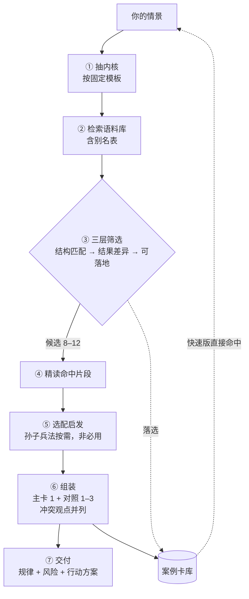

# 古籍抉择推演 · 工作规范 v1.1

2026-09-27 ｜ 语料主位置：本地语料根目录（不入库）｜ 案例卡库：`cases/`

---

## 1 定位

用历史案例帮你看清**选项的结构**和**人性的模式**，产出规律启发与行动方案。不是学术研究。

**诚实底线（不可让）**：不编造原文；不用译文冒充原文；版本标注清楚；作者偏向如实标注。

**不做的事**：不给统一结论。同一个抉择在不同人生阶段、不同约束下答案不同。我的职责是把选项结构和代价摆清楚，具体案例具体分析。

---

## 2 两条通道（按问题复杂度分流）

| | 快速版 | 完整版 |
| --- | --- | --- |
| 适用 | 简单问题；或案例卡库里已有近似情景 | 复杂决断：重大取舍、多方博弈、不可逆后果 |
| 动作 | ① 查案例卡库 ② 命中就直接给参考，附一句差异提醒 | 走完整流程 |
| 案例数 | 1 个 | ≤4 个（主卡 1 + 对照 1–3） |
| 篇幅 | 一段话到半页 | 1,500–2,500 字 |
| 孙子兵法 | 不套用 | 情景涉及竞争、权力、资源时套用，否则不用 |

**判定权在我，你可以直接指定**"要完整版"或"简单说说就行"。

---

## 3 完整流程

**情景内核模板（固定句式）**

〔主体〕在〔什么系统〕中，因〔什么属性或动作〕触发了〔谁的什么风险〕，面临〔选项 A〕与〔选项 B〕的选择，约束是〔时间／资源／不可逆性〕。

---

## 4 语料分四层（无特权层）

| 层 | 书目 | 作用 |
| --- | --- | --- |
| 文本层 | 史记、资治通鉴、战国策 | 事件与人物叙事，主引文来源 |
| 解读层 | 熊逸版、读通鉴论、韩非子、孙子兵法、智囊 | 判断、机制分析、启发。均非必用 |
| 检验层 | 希腊罗马名人传、伯罗奔尼撒战争史 | 跨文明对照 |
| 校勘层 | 点校本扫描 PDF | 仅争议时定点核对 |

《孙子兵法》与其余各书同级：给的是启发与判据线索，不是必选的行动指南。

---

## 5 来源标记（每条引文必带）

`原文` ｜ `史家评`（太史公曰、臣光曰）｜ `今人解读`（熊逸、王夫之等）｜ `案例叙述`（后世编写的战例、寓言）

格式：书名 · 版本 · 卷篇 · 纪年。例：《资治通鉴》卷第一·周纪一，威烈王二十三年。

---

## 6 冲突处理与作者偏向（D4）

**规则一　　全摆出来再分析。** 同一事件有不同记载或评价时，把事实与观点全部并列，标明各是谁说的、依据什么，然后才给分析。不合并成一句"一般认为"。

**规则二　　去除作者偏向。** 每本书的立场登记在 `cases/authors.md`；引用时按登记提示加一句偏向说明。

**规则三　　不确定就查，只查可靠来源。** 若对某作者或某版本的偏向没有把握，可上网检索，但只采用学术出版机构、作者本人著述、权威辞书；不采用营销号、内容农场、无署名的二手拼贴。

---

## 7 置信度判定标准（G5）

| 等级 | 判定条件 |
| --- | --- |
| 高 | 有一手叙事支撑，且至少两个独立来源一致 |
| 中 | 只有一个来源，或各来源细节有出入但主干一致 |
| 低 | 只有单一作者的论断，或来源为后世转述、改编本 |

---

## 8 案例卡库（G1）

位置 `cases/`：

- `cases/index.md`　卡片总表，快速版检索入口
- `cases/cards/case-NNN-名称.md`　单张案例卡
- `cases/aliases.md`　人名与术语别名表
- `cases/authors.md`　作者偏向档案

**漏检检查规程（G4）**

每新增一张卡，用卡上的"检索关键词"回跑一次全库检索，确认能命中该卡自身；命中失败说明关键词或别名有漏，修好再入库。

检索前必须先做三步归一化，否则一定漏检：

1. 去空白：移除空格、换行、全角空格（电子书正文常逐字带空格）。
2. 去注号：移除 `[数字]` 形式的注释序号（如"不善[23]代之"→"不善代之"）。
3. 去标点：逗号、顿号、引号一并移除后比对。

三步缺一不可，实测各抓到一次真实漏检：不去注号则「乐毅知燕惠王之不善代之」为 0；不去标点则「狡兔死走狗烹」为 0（原文作"狡兔死，走狗烹"）。

---

## 9 四条风险红线（输出必带）

1. 史书有立场：太史公曰、臣光曰是判断，不是史实。
2. 不能推概率：史册只记录极端成败，样本被筛选过。
3. 时代不可通约：古代"出走"意味着改换国家，现代换工作的成本低得多。
4. 跨文明类比谨慎：古希腊案例用于证明共性，不用于照搬做法。

---

## 10 语料库（工作文件已锁定）

| 书目 | 选用文件 | 提取字数 | 状态 |
| --- | --- | --- | --- |
| 史记（精注全译 12 册） | `.epub` | 269 万 | 干净 |
| 资治通鉴全本（20 册） | `.epub` | 846 万 | 干净（早前误判已更正） |
| 战国策（全本全注全译） | `.epub` | 58 万 | 中华书局版 |
| 孙子兵法（6 册） | `.epub` | 165 万 | 干净 |
| 熊逸版 1–3 辑 | `.epub` | 274 万 | 有页眉需清洗 |
| 读通鉴论 | `.epub` | 240 万 | 干净 |
| 韩非子 | `.epub` | 48 万 | 干净 |
| 希腊罗马名人传（5 册） | `.epub` | 182 万 | 干净 |
| 伯罗奔尼撒战争史 | `.epub` | 64 万 | 徐松岩译注本 |
| 智囊 | `.epub` | 19 万 | 选本，非全集 |
| 贞观政要 | 仅 PDF | — | 扫描件，不可读 |

---

## 11 工作约定

- 语料主位置为本地只读目录（不入版本库）；中间产物 `work/`；交付物 `outputs/`；案例库 `cases/`。
- **输出文件命名与措辞（面向读者）**：文件名用 `案例NN-主题.md`，不带版本号，也不用"样板"这类开发词。正文不出现 v1／v2、"本次变更"、"结论是否改变"、"我此前判断有误"、检索过程、卡片编号等实现细节；来源标记与置信度保留，因为它们是内容的一部分。版本演进只记录在本规范的变更记录里。
- 不扫描全盘，只在指定目录内操作，扩大范围先征得同意。
- 删除规则：先逐条列出文件、理由、影响，获许可后执行，且移入回收站而非永久删除。
- 机械批量处理用脚本；需要判断力的批量提炼才用子代理。

---

## 12 决策记录

| # | 议题 | 决定 |
| --- | --- | --- |
| D1 | 输出分档 | 分档。简单问题走快速版或直接查案例卡，不走完整流程 |
| D2 | 孙子兵法是否必用 | 非必用。与其他书同级，只提供启发 |
| D3 | 反事实推演 | 加，但只给复杂案例加；快速版不加 |
| D4 | 史料冲突 | 事实与观点全部并列再分析，并尽量去除作者偏向；不确定的偏向可查可靠来源 |
| D5 | 是否统一标准动作 | 不设统一动作，具体案例具体分析；提问不限于职场 |

---

## 13 媒体发布版文风要求

面向公开发布的输出（公众号、知乎、口播稿等），在上述规则之外另守以下文风约定：

1. **文件名即标题**，不带编号、不带版本号、不加"媒体版"这类后缀。
2. **主体用"我们"，不用"你"。** 假设立场是"我们遇到了这个问题"，避免说教感。对话、引文、对方的话里可以保留"你"。
3. **开篇先给原文，再给白话。** 原文成块引用并在末尾署名（如"——乐毅《报燕惠王书》"），紧接着一句点题（如"两千三百年前，有一个人遇到了和我们一模一样的问题"），然后才展开故事。
4. **小标题用人名加一句钩子**，不用"关键一／关键二"这类序号式标题。成文时人名为首，后接短句，如"乐毅：他不是逃，是先保住自己"。
5. **正文不出现表格。** 一切对照关系写成段落。
6. **元数据与实现细节不入正文。** 来源标记、置信度、检索词、卡片编号、"本次""修订"一律不出现；出处压成文末一节。
7. **相反评价必须并列**，并写明是谁说的。同一人物有分歧判断时两说都写，不合并成"一般认为"。
8. **故事优先于结论。** 每个案例走"悬念 → 转折 → 结局"，分析与判据跟在故事之后，不单独成章。
9. **末三节固定**：我们能做的事 ／ 后记 ／ 参考史料。
10. **语气克制**，不煽动、不喊口号；后记只留一条最重要的提醒，不堆条目。

---

## 14 变更记录

- v1.1：落地 D1–D5；新增两条通道、情景内核模板、冲突与偏向规则、置信度标准；建立案例卡库与别名表；解决 G1–G5。
- v1.2：新增第 13 节"媒体发布版文风要求"（依首次媒体版修订的实际做法固化）；输出文件名改为文件名即标题。
- v1.0：精简重写，合并重复章节。
- 更早：v0.1 建立 → v0.2 定位实用非学术 → v0.3 接入孙子兵法 → v0.4 全库甄别与输出预算。
